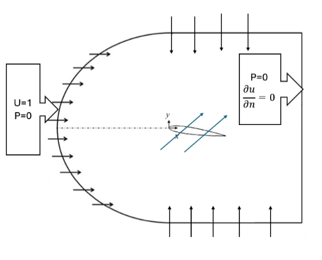
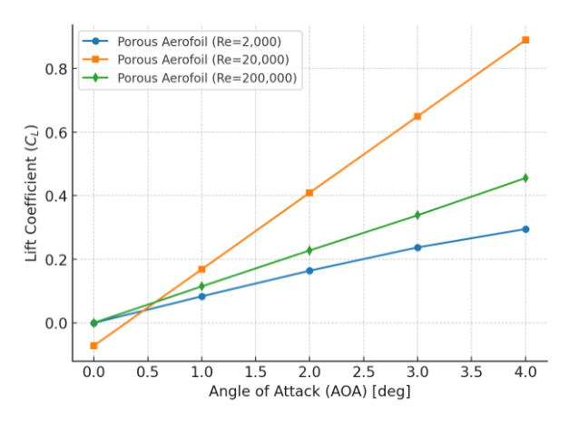
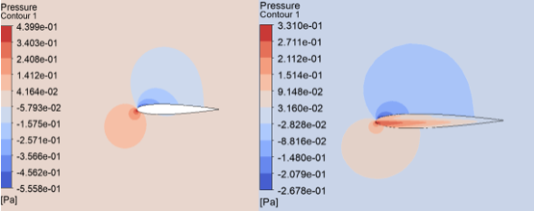
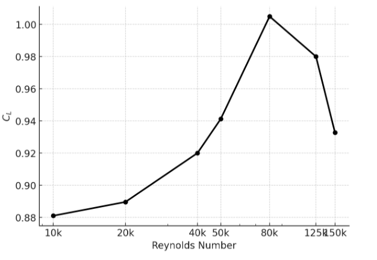

# Porous Aerofoil CFD — Aerodynamic Performance Investigation

A numerical study comparing porous and solid NACA 0012 aerofoils across low-to-moderate Reynolds numbers, targeting UAV and drone applications. Inspired by how birds use controlled feather porosity to achieve quieter, more efficient flight — the same principle is applied to an engineered aerofoil.


*Bird feather porosity compared to a conventional aerofoil — the biological inspiration for this work.*

Porosity is modelled via Darcy's law as a momentum source term in the incompressible Navier–Stokes equations, implemented in ANSYS Fluent on a NACA 0012 geometry.


*C-type computational domain with boundary conditions. Inlet velocity U = 1 m/s; pressure outlet on the right.*

---

## Results

### Lift Coefficient vs Angle of Attack


*Lift coefficient increases significantly with Reynolds number. At Re = 20,000 the porous aerofoil shows the steepest lift curve, suggesting an optimal operating regime.*

| Re | AOA Range | CL Increase vs Solid |
|---|---|---|
| 2,000 | 1°–4° | 57–75% |
| 20,000 | 1°–4° | 100–168% |
| 200,000 | 1°–4° | 33–37% |

### Drag Behaviour

| Re | Low AOA | High AOA |
|---|---|---|
| 2,000 | +2–7% (penalty) | penalty reduces slightly |
| 20,000 | up to −93% (reduction) | slight penalty at 4° |
| 200,000 | up to −73% (reduction) | exceeds solid at 4° |

### Pressure Field Comparison — Solid vs Porous


*Left: solid aerofoil. Right: porous aerofoil. The porous case shows a broader low-pressure footprint on the suction side and a stronger pressure patch beneath the nose, producing a larger pressure differential and higher lift.*

### Peak Lift vs Reynolds Number


*CL peaks at approximately 1.005 around Re ≈ 80,000 before declining as the boundary layer transitions. This identifies the most aerodynamically efficient operating point for this porous configuration.*

---

## In-House Post-Processing Tool

Because the porous aerofoil surface is modelled as an interior interface rather than a solid wall, standard Fluent surface-integration reports cannot be used to extract lift and drag. A custom **control-volume (CV) momentum balance** tool was developed to handle this.

### Methodology

A rectangular control volume is defined around the aerofoil with four bounding faces: inlet, outlet, top, and bottom. Field data (velocity components, pressure, and velocity gradients) are exported from Fluent onto rake surfaces coinciding with these faces.

The tool applies the steady incompressible integral momentum equation:

```
F_body = -(F_convective + F_pressure + F_viscous)
```

Each contribution is computed as follows:

- **Convective term** — momentum flux through each face, integrated as ρ(u·n)u over the face area
- **Pressure term** — net hydrostatic force, integrated as p·n over the face area
- **Viscous term** — traction from the full 2D deviatoric stress tensor (τ·n), constructed from exported velocity gradients and dynamic viscosity

Node data are midpoint-averaged to face-centred values before integration. A mass flow imbalance check is performed across all four faces to verify conservation and confirm numerical consistency before forces are accepted. The resulting Cartesian force components are then rotated by the angle of attack to yield lift and drag.

### Why this approach

Standard solvers report forces by integrating pressure and shear directly on the aerofoil surface. For a porous aerofoil, this surface is an interior zone boundary in Fluent — force reports are unreliable or unavailable. The CV approach side-steps this entirely by working on the far-field boundary where the flow is well-resolved and the integration is unambiguous.

---

## Dependencies

```
ANSYS Fluent   — CFD solver and field data export
Python         — post-processing (NumPy, Pandas)
```
